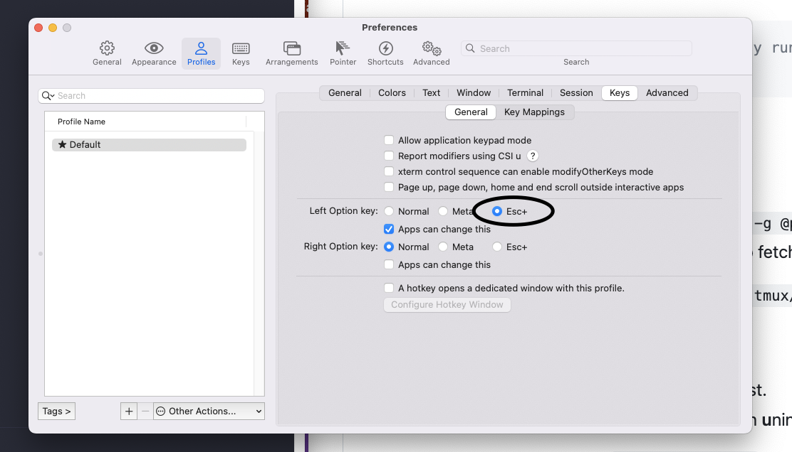

# vim-my-way

Personal configuration files.

**Table of Contents**

- [Shell Conf](#shell-conf)
  - [Requirements](#requirements)
  - [Utilities](#utilities)
  - [Aliases](#aliases)
- [Tmux Conf](#tmux-conf)
- [NeoVim](#neovim)
- [Git Aliases](#git-aliases)
- [Shell aliases](#shell-aliases)
- [Linux Bootstrapping](#linux-bootstrapping)
  - [Contents](#contents)
  - [Usage](#usage)

## Shell Conf

### Requirements

- `curl` or `wget`
- `git`
- [fzf](https://github.com/junegunn/fzf#installation)
- [Zsh](https://github.com/ohmyzsh/ohmyzsh/wiki/Installing-ZSH)
- [Nerd fonts](https://www.nerdfonts.com/font-downloads) of your choice

### Steps

```shell
$ shell/install.sh
```

### Other utilities

- [bat](https://github.com/sharkdp/bat#installation)
- [jq](https://github.com/stedolan/jq)

When Oh My Zsh is installed, you will enter a new shell session. Don't panic and just Ctrl + D to continue installation

### Aliases

In case of Oh My Zsh:

```
$ ln -s ~/vim-my-way/shell/aliases.zsh $ZSH_CUSTOM
```

## Tmux Conf

1. Get latest [tmux](https://github.com/tmux/tmux/wiki/Installing)
2. Get latest [TPM](https://github.com/tmux-plugins/tpm#installation)
3.

```
$ mkdir ~/.config/tmux	# If it does not exist yet
$ ln -s ~/vim-my-way/tmux/tmux.conf ~/.config/tmux/tmux.conf
```

Note: if you are using iTerm2 and you want to use opt character as Meta, please do the following:



## NeoVim

See [init.nvim repo](https://github.com/soutoner/init.nvim)

For easier usage (vim vs nvim command) see [Shell aliases](#shell-aliases) section.

## Git Aliases

```
$ ln -s ~/vim-my-way/git/gitalias.txt ~
$ cp ~/vim-my-way/git/.gitconfig ~/.gitconfig
```

## Linux Bootstrapping

Script with configuration file that will bootstrap your brand new linux! Please, I encourage you to read the configuration file before using the script.

### Contents

```
####################################################
# Script that bootstraps a linux environment.
# All the tools marked with (opt) can be marked
# to install in the file "conf.yml".
# Before executing this script please, take
# a look at it!
#
# Tested on:
#   - Ubuntu MATE 15.10
#
# Contents:
#
#   . Utilities & tools
#       - Curl
#       - Composer
#       - KeepassX (opt)
#   · Development
#       - Oracle JVM
#       · Languages
#           - PHP 5
#           - Java 8
#       · VCS
#           - Git
#       · IDE
#           - Vim (w/ Vundle and 256-colors support)
#           - Gvim (opt)
#           - PHPStorm (opt)
#           - WebStorm (opt)
#   · Databases
#       - MySQL
#   · Application server
#       - Apache
#   · Notes
#       - Check available configs for
#           particular tools inside "conf.yml"
####################################################
```

### Usage

```
git clone https://github.com/soutoner/vim-my-way ~/vim-my-way
cd ~/vim-my-way/bootstrap
chmod +x linux.sh
./linux.sh
```
